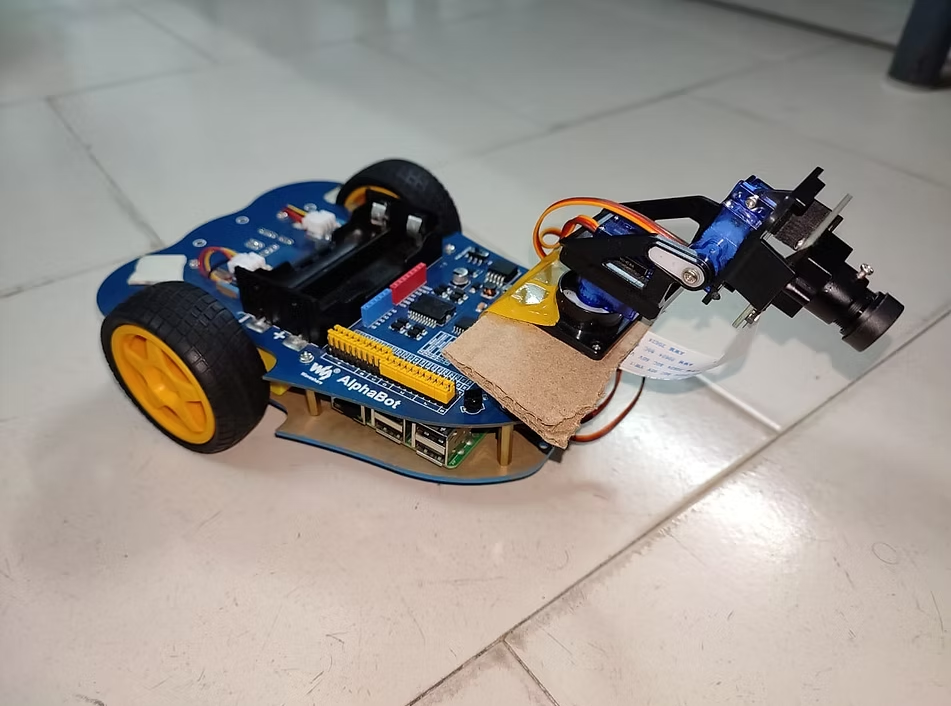
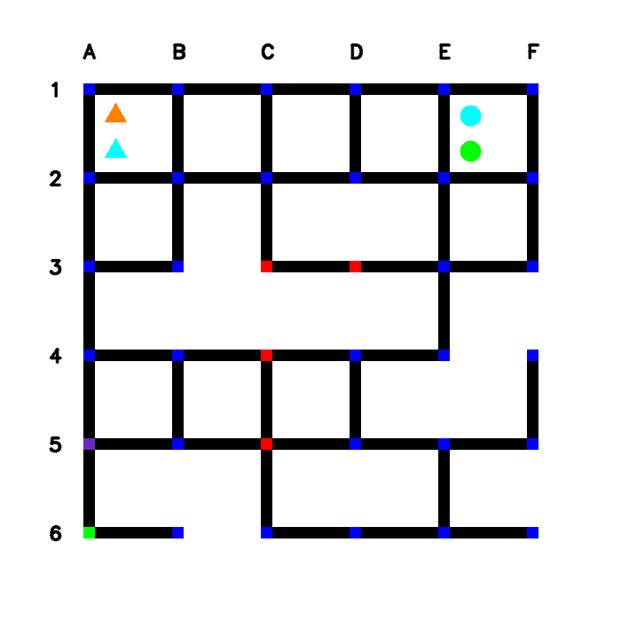
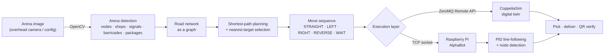
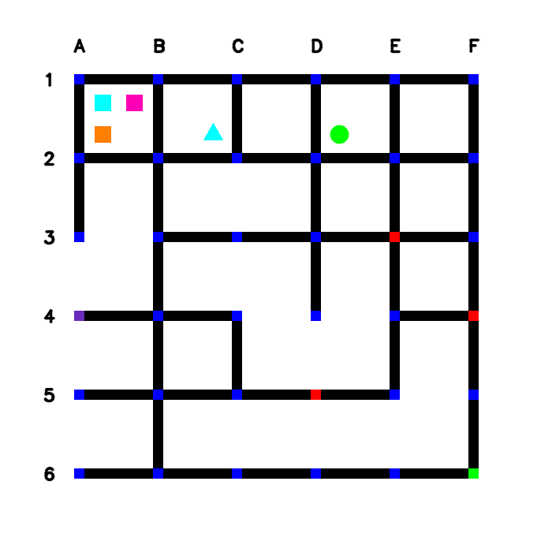
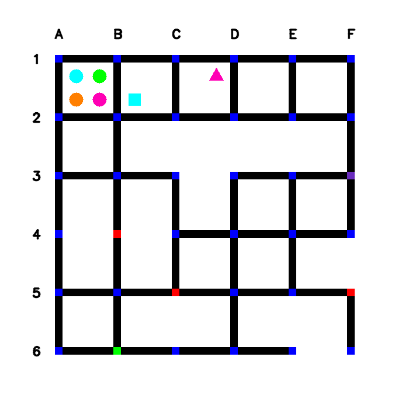
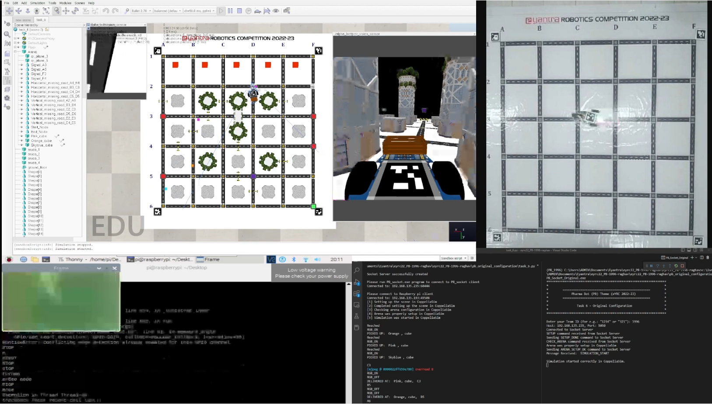
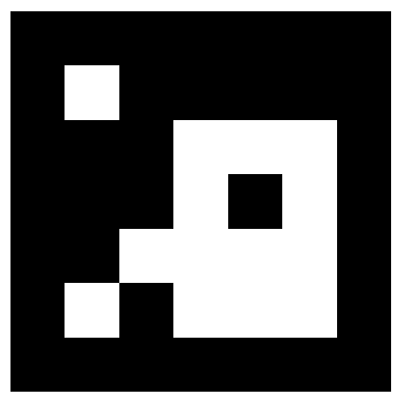
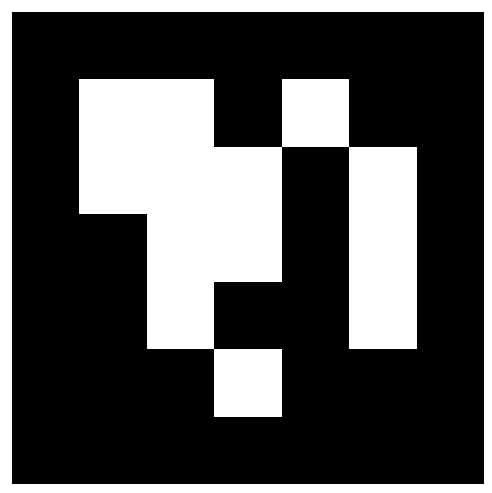
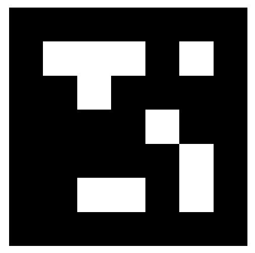
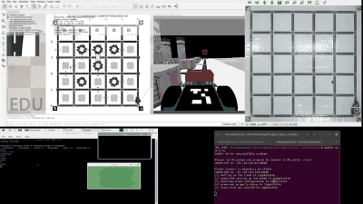

<div align="center">

# Pharma Bot — Autonomous Medicine-Delivery Robot

**A vision-guided robot that reads a pharmacy arena, plans the shortest delivery route, and carries colour-coded medicine packages to the right shops — first in a CoppeliaSim digital twin, then on real Raspberry Pi hardware.**

Built for the **e-Yantra Robotics Competition (eYRC) 2022-23**, organised by **e-Yantra, IIT Bombay** (sponsored by the Ministry of Education, Government of India).

[](https://www.python.org/)
[](https://opencv.org/)
[](https://www.coppeliarobotics.com/)
[](https://www.raspberrypi.com/)
[](https://portal.e-yantra.org/)
[](LICENSE)

<p align="center">
  
  &nbsp;&nbsp;
  
</p>

<sub>Left: the AlphaBot built for the hardware run — Raspberry Pi, PiCamera and differential drive. Right: one of the five arena layouts the system parses, where coloured shapes are medicine packages at shops and the grid is the road network the robot must navigate.</sub>

</div>

---

## Table of Contents

- [Overview](#overview)
- [The Theme](#the-theme)
- [System Architecture](#system-architecture)
- [Features](#features)
- [Technology Stack](#technology-stack)
- [How It Works](#how-it-works)
  - [1. Arena Perception](#1-arena-perception-computer-vision)
  - [2. Path Planning](#2-path-planning)
  - [3. Digital-Twin Simulation](#3-digital-twin-simulation-coppeliasim)
  - [4. Vision-Based Localization](#4-vision-based-localization-aruco)
  - [5. Hardware Execution](#5-hardware-execution-raspberry-pi-alphabot)
- [Demo](#demo)
- [Repository Structure](#repository-structure)
- [Getting Started](#getting-started)
- [Running the Project](#running-the-project)
- [Results](#results)
- [Acknowledgements](#acknowledgements)
- [License](#license)

---

## Overview

Pharma Bot is an end-to-end autonomous robotics pipeline that takes a robot from *perception* all the way to *physical actuation*. Given only a top-down image of a city-style arena, the system figures out where the shops, packages, traffic signals and road closures are, decides the most efficient set of pick-ups and deliveries, and then drives a robot to execute that plan — picking up medicine packages from shops and dropping them at the correct destinations.

The project was developed across the multi-stage eYRC 2022-23 season, where each stage added a new layer of capability: image processing, graph search, robot simulation, camera-based localization, and finally a fully working hardware robot. Everything in this repository works against **five distinct arena configurations**, so the solution is general rather than hard-coded to a single layout.

---

## The Theme

The eYRC "Pharma Bot" theme frames a real-world logistics problem as a robotics challenge. A pharmacy district is laid out as a grid of roads connecting **shops** (which hold medicine packages) and **delivery points**. The robot must:

- identify every medicine package, described by a **colour** (Green, Orange, Pink, Sky-blue) and a **shape** (cube, cone, cylinder);
- respect **traffic signals** (stop-and-wait nodes) and **roads under construction** (barricades that block certain edges);
- pick packages from shops and deliver each one to the destination encoded in a **QR code** at the drop location;
- do all of this while minimising the distance travelled.

---

## System Architecture



The same planning brain drives two interchangeable execution back-ends: a **simulated robot** in CoppeliaSim for development and verification, and a **physical AlphaBot** on a Raspberry Pi for the real run. A lightweight socket layer keeps the host controller, the simulator and the robot in sync.

---

## Features

- **Fully autonomous perception-to-delivery loop** — no manual waypoints; the route is computed from the arena image alone.
- **Robust arena parsing** with OpenCV: node detection, traffic-signal detection, start/end nodes, barricade (road-under-construction) detection, and medicine-package recognition by colour *and* shape.
- **Graph-based shortest-path planning** with a nearest-target heuristic that orders multiple pick-ups and deliveries efficiently.
- **Direction synthesis** that converts an abstract node path into concrete robot moves, accounting for the robot's current heading and any traffic signals along the way.
- **CoppeliaSim digital twin** that programmatically builds the scene (packages, signals, barricades, nodes) and runs the full mission.
- **Camera-based localization** using ArUco markers and a perspective transform to map real-world pose into simulator coordinates.
- **Real-time PID line-following** on hardware, with encoder-assisted in-place turns and QR-driven RGB feedback for picked packages.
- **Generalises across five arena configurations**, validated end-to-end in both simulation and hardware.

---

## Technology Stack

| Area | Tools & Libraries |
|------|-------------------|
| Language | Python 3.9 |
| Computer Vision | OpenCV, NumPy, ArUco markers, `pyzbar` (QR decoding) |
| Simulation | CoppeliaSim, ZeroMQ Remote API (`pyzmq`) |
| Hardware | Raspberry Pi, `RPi.GPIO`, PiCamera, DC gear motors (PWM), rotary encoders, RGB LEDs |
| Robot platform | AlphaBot |
| Communication | TCP sockets, multithreading |
| Control | PID controller for line following |

---

## How It Works

### 1. Arena Perception (Computer Vision)

A single top-down image of the arena is enough to bootstrap the entire mission. The vision module (`PB_theme_functions.py`) processes the image to extract:

- **Nodes & roads** — the grid of intersections and the drivable connections between them, assembled into a graph.
- **Traffic signals** — nodes where the robot must stop and wait.
- **Roads under construction** — horizontal/vertical edges that are barricaded and must be routed around.
- **Start & end nodes** — where the mission begins and ends.
- **Medicine packages** — detected by colour and shape and associated with their host shop.

<div align="center">



<br/>
<sub>Three of the five arena layouts the perception pipeline handles without any layout-specific tuning.</sub>
</div>

### 2. Path Planning

With the arena reduced to a graph, `path_planning()` finds the shortest route between any two nodes, and `paths_to_moves()` turns that node sequence into the robot's actual command list — `STRAIGHT`, `LEFT`, `RIGHT`, `REVERSE`, and `WAIT` — based on the robot's heading and the traffic signals it will encounter. When several shops or drop points are pending, a nearest-node strategy picks the closest target at each step so the robot never backtracks unnecessarily.

### 3. Digital-Twin Simulation (CoppeliaSim)

Before touching hardware, the entire mission runs in a CoppeliaSim digital twin. Over the ZeroMQ Remote API, the controller places packages, traffic signals, barricades and start/end markers into the scene, then drives the AlphaBot model through pick-up and delivery actions. QR codes at each drop location are decoded (`pyzbar`) to confirm the correct destination for every package.

<div align="center">

<br/>
<sub>The system running live: the CoppeliaSim digital twin with the AlphaBot in the arena (centre), the overhead camera view used for localization (right), and the planner's console output (bottom).</sub>
</div>

### 4. Vision-Based Localization (ArUco)

To close the loop between the real world and the simulator, an overhead camera feed is rectified using four corner **ArUco markers** and a perspective transform, cropping out a clean top-down view of the arena. A fifth ArUco marker on the robot is then tracked, and its pose is converted into CoppeliaSim coordinates — letting a physical camera drive the simulated robot in real time.

<div align="center">





<br/>
<sub>ArUco markers — four define the arena corners for perspective correction; the fifth localizes the robot.</sub>
</div>

### 5. Hardware Execution (Raspberry Pi AlphaBot)

On the physical robot, a Raspberry Pi streams frames from the PiCamera and runs an OpenCV line-detection pipeline. A **PID controller** keeps the robot centred on the line, while threshold/HSV masks detect nodes and turning points. Encoder feedback drives precise in-place left, right and reverse turns at intersections. The planned route arrives from the host controller over a TCP socket, and an RGB LED lights up in the colour of each medicine currently on board — turning off as packages are delivered.

---

## Demo

<div align="center">

<br/>
<sub>A short preview of the robot running the mission.</sub>
</div>

The complete recorded runs are available in the repository:

- **[`Videos/Final.mp4`](Videos/Final.mp4)** — the full mission executed end-to-end *(stored via Git LFS)*
- **[`docs/pharma-bot-prev.mp4`](docs/pharma-bot-prev.mp4)** — the lightweight preview clip shown above

---

## Repository Structure

```
eyrc22_Pharma_Bot/
├── Task_3C_Resources/        # Vision-based localization in CoppeliaSim (ArUco + perspective transform)
├── PB_Task4B_Ubuntu/         # Full mission in the CoppeliaSim digital twin (Ubuntu)
├── PB_Task5_Windows/         # Host controller + Raspberry Pi client (hardware run)
│   ├── RPi/                  # On-robot code: line following, motor control, RGB feedback
│   └── config_1 … config_5/  # The five arena configurations
├── pb_original_configuration/# Final combined configuration and reference run
├── ArUco_images/             # ArUco markers used for arena corners and robot pose
└── Videos/                   # Recorded demonstration run (Git LFS)
```

Each `task_*.py` script corresponds to a stage of the competition, and `PB_theme_functions.py` is the shared library of perception, planning and simulation routines used throughout.

---

## Getting Started

### Prerequisites

- **Python 3.9**
- **[CoppeliaSim](https://www.coppeliarobotics.com/)** (EDU edition) for the simulation tasks
- **[Git LFS](https://git-lfs.com/)** to pull the demo video and binary assets
- Python packages: `numpy`, `opencv-python`, `pyzmq`, `pyzbar`
  - `pyzbar` requires the system **ZBar** library (`sudo apt install libzbar0` on Ubuntu)
- For the hardware run: a **Raspberry Pi** with `RPi.GPIO` and `picamera`, wired to an **AlphaBot** chassis

### Installation

```bash
# Clone the repository (with Git LFS so the demo video comes through)
git lfs install
git clone https://github.com/Manas-arumalla/eyrc22_Pharma_Bot.git
cd eyrc22_Pharma_Bot

# Install Python dependencies
pip install numpy opencv-python pyzmq pyzbar
```

---

## Running the Project

The system uses a host controller that bridges the simulator and (optionally) the robot over sockets. At a high level:

1. **Launch CoppeliaSim** and load the arena scene.
2. **Start the arena bridge** — run the provided `PB_socket` binary, which connects the controller to the scene configuration.
3. **Run the task controller** for the stage you want, e.g.:

   ```bash
   # Full simulation run (Ubuntu)
   cd PB_Task4B_Ubuntu
   python3 task_4b.py
   ```

4. **(Hardware)** On the Raspberry Pi, start the on-robot client so it connects back to the host and waits for its route:

   ```bash
   # On the Raspberry Pi
   cd PB_Task5_Windows/RPi
   python3 task_5RPi.py
   ```

The controller then sets up the scene, plans the routes, and drives the robot through the pick-up and delivery sequence — in simulation, on hardware, or both.

---

## Results

- Completed the full **perception → planning → simulation → hardware** pipeline for the Pharma Bot theme.
- Verified end-to-end operation across **all five arena configurations**, including layouts with traffic signals and roads under construction.
- Demonstrated a working **CoppeliaSim digital twin** and a **physical AlphaBot** running the same mission logic.
- Achieved real-time **PID line-following** with encoder-based turns and QR-verified deliveries on hardware.
- Evaluation outputs for the graded tasks are included (`task4b_output.txt`, `task6_original_output.txt`).

---

## Acknowledgements

- **[e-Yantra](https://www.e-yantra.org/), IIT Bombay** — for designing the Pharma Bot theme and providing the simulation framework, arena assets and evaluation tooling as part of eYRC 2022-23.
- **[CoppeliaSim](https://www.coppeliarobotics.com/)** by Coppelia Robotics — the robotics simulator used for the digital twin.

The competition-provided framework files (the `PB_socket` bridge, arena models and `zmqRemoteApi` client) remain the property of their respective authors and are included here to keep the project runnable.

---

## License

Released under the [MIT License](LICENSE).
